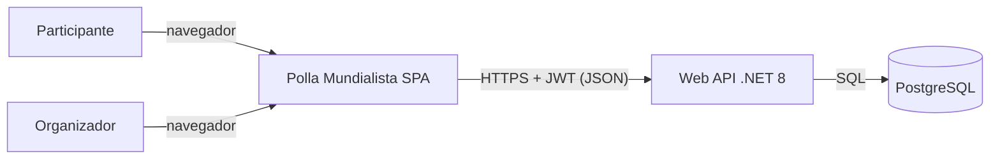
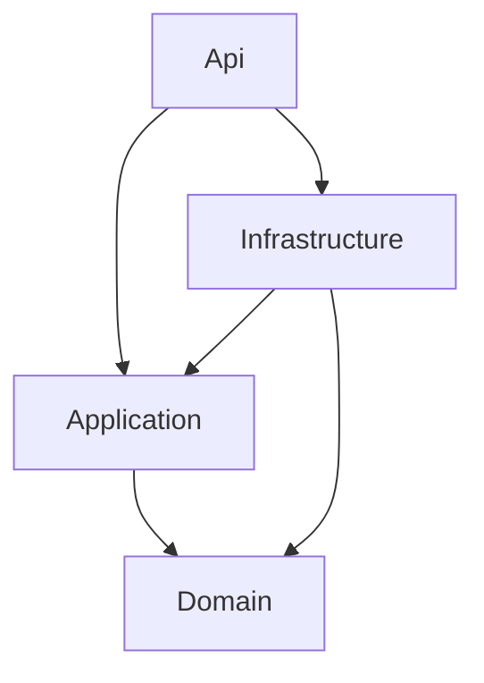
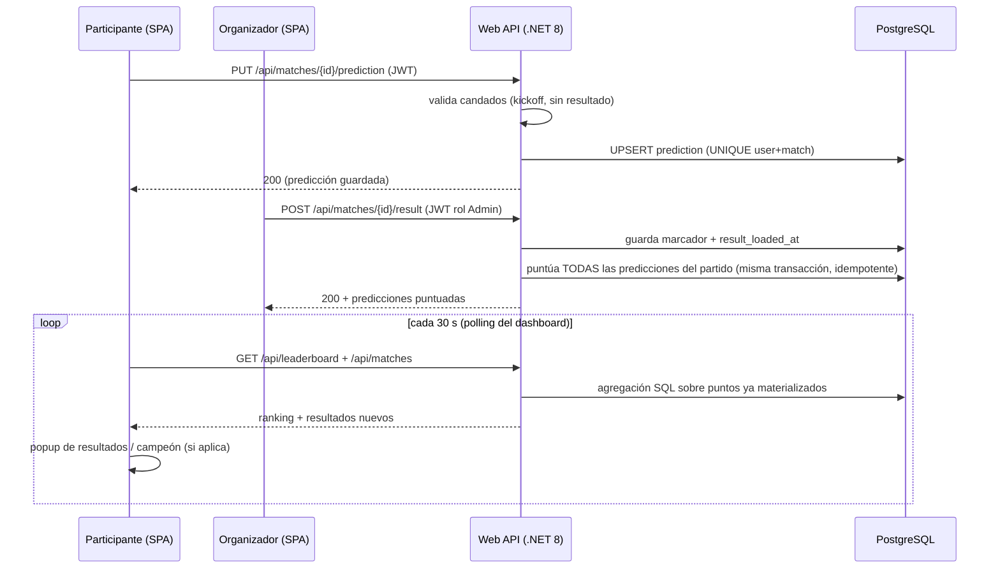
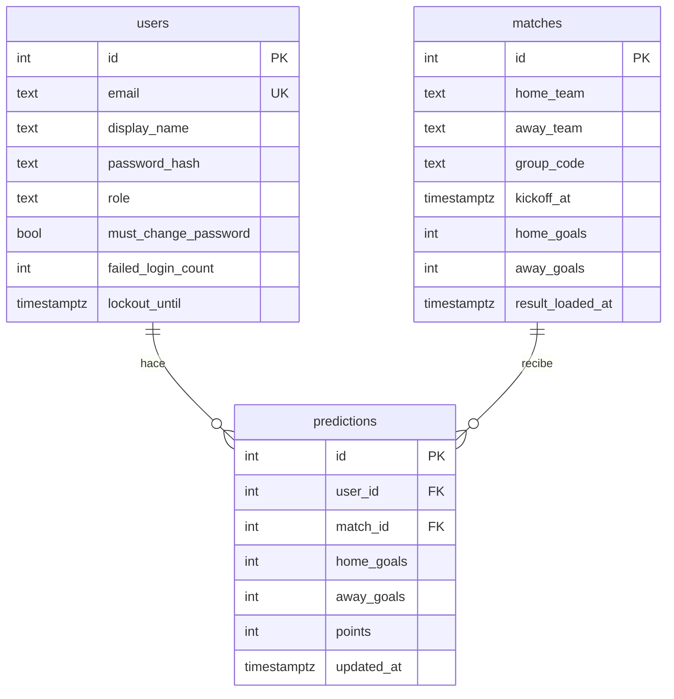
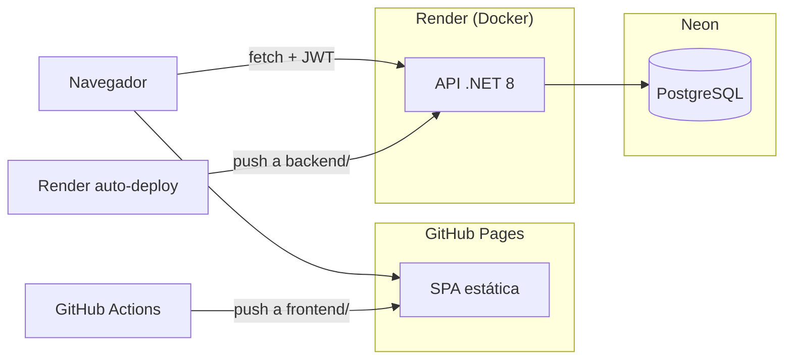

# Arquitectura — Polla Mundialista

Vista de la solución en tres niveles (contexto → contenedores → componentes del
backend), más la topología de despliegue y el razonamiento de escalabilidad.
Las decisiones detrás de cada elección están en [DECISIONS.md](DECISIONS.md).

---

## 1. Contexto

Dos tipos de persona usan el sistema:

- **Participante**: ve los 12 partidos, registra/edita sus pronósticos antes del
  kickoff, consulta el ranking y su historial.
- **Organizador (Admin)**: crea las cuentas del grupo (modelo de grupo privado, sin
  registro público), carga resultados reales y ve la actividad del torneo.



No hay integraciones externas: los resultados los carga el organizador y el sistema
puntúa. Esto es deliberado (ver DECISIONS.md, fuera de alcance).

---

## 2. Contenedores

| Contenedor | Tecnología | Responsabilidad |
|---|---|---|
| SPA | React 18 + Vite | UI por rol, portales de login separados, ranking activo, popups de resultados/campeón, pantalla de arranque en frío |
| Web API | .NET 8, Clean Architecture | Autenticación y autorización, reglas del juego, puntuación, endurecimiento (rate limit, lockout, gate de cambio de contraseña) |
| Base de datos | PostgreSQL 16 | Única fuente de estado: usuarios, partidos, predicciones, puntos materializados |

La SPA y el API se comunican exclusivamente por HTTP/JSON con Bearer JWT; no
comparten código ni sesión. Son repos-hermanos dentro del monorepo (`frontend/`,
`backend/`) con despliegues independientes.

---

## 3. Componentes del backend (Clean Architecture)

```
backend/
├── PollaMundialista.Api             capa de presentación
│   ├── Controllers/                 Auth, AdminUsers, Matches, Leaderboard, Users
│   ├── Middleware/                  envelope de errores, gate pwd_change, security headers
│   └── Program.cs                   composición: JWT, rate limiter, CORS, EnsureCreated+seed
├── PollaMundialista.Application     contratos (DTOs), códigos de error, PasswordPolicy
├── PollaMundialista.Domain          entidades + ScoringService (puro, sin dependencias)
├── PollaMundialista.Infrastructure  EF Core (mapeo snake_case), seeder, emisión de JWT
└── PollaMundialista.Tests           13 unitarias (scoring) + 33 integración (app real
                                     vía WebApplicationFactory sobre SQLite en memoria)
```

Regla de dependencias (solo hacia adentro):



- **Domain** no referencia nada: el motor de puntuación 3/1/0 es una función pura
  testeable en aislamiento.
- **Application** define el vocabulario (DTOs, códigos de error del envelope
  `{error:{code,message}}`, política de contraseñas).
- **Infrastructure** implementa persistencia y tokens; es la única capa que conoce
  EF Core y Npgsql.
- **Api** orquesta: controllers delgados + pipeline (rate limiting en `/api/auth`,
  autenticación JWT, gate `pwd_change`, autorización por rol).

### Flujo crítico: carga de un resultado

```
POST /api/matches/{id}/result  (rol Admin)
  → valida partido y marcador
  → guarda home_goals / away_goals / result_loaded_at
  → puntúa TODAS las predicciones del partido en la misma transacción
    (idempotente: recargar/corregir sobreescribe puntos, nunca acumula)
  → el ranking es después una agregación SQL sobre puntos ya materializados
```

---

### Flujo de datos de punta a punta (pronóstico → resultado → ranking)



Este flujo resume las tres garantías del sistema: el candado de predicciones y el
constraint único se validan en servidor y base, la puntuación se materializa de forma
atómica e idempotente al cargar el resultado, y las lecturas calientes (ranking) son
agregaciones baratas que el front refresca solo.

## 4. Modelo de datos

Fuente de verdad: [`backend/db/schema.sql`](../backend/db/schema.sql)
(EF Core mapea explícitamente a este esquema; `seed.sql` documenta los 12 partidos).



Invariantes en la base (no solo en código): `UNIQUE(user_id, match_id)`,
FKs, goles `>= 0`. Índices sobre las rutas calientes: predicciones por partido
(puntuación), predicciones por usuario (historial) y el UNIQUE cubre el par.

---

## 5. Topología de despliegue



- **Front**: workflow de Actions construye y publica en Pages en cada push que toca
  `frontend/`; la URL del API entra por variable de build (`VITE_API_URL`).
- **API**: Render construye la MISMA imagen Docker que se usa en local
  (`backend/Dockerfile`, blueprint `render.yaml`); secretos (conexión, JWT, CORS)
  por variables de entorno — nada sensible en el repo.
- **Local**: `docker-compose up` levanta API + Postgres idénticos a producción
  (instrucciones en el README raíz).
- Nota del tier gratuito: Render duerme el API tras inactividad; la SPA lo cubre con
  una pantalla de arranque que sondea `/health`.

---

## 6. Por qué esta arquitectura escala

1. **API stateless**: la autenticación viaja completa en el JWT (incluido el estado
   de cambio de contraseña pendiente, como claim). Cero afinidad de sesión → N
   instancias detrás de un balanceador sin cambios de código.
2. **Lecturas baratas por diseño**: los puntos se materializan al cargar cada
   resultado (escritura poco frecuente, hecha por un admin), así que el ranking —
   la lectura caliente — es una agregación indexada, nunca un recálculo.
3. **Escritura correcta bajo concurrencia**: el constraint único hace imposible la
   predicción duplicada aunque lleguen requests simultáneos; la puntuación es
   idempotente, así que un reintento o corrección no corrompe puntos.
4. **Despliegues independientes**: front estático en CDN (Pages) y API en contenedor
   evolucionan y escalan por separado.
5. **El único estado es la base**: cuello de botella conocido y con escalera
   estándar — índices (hechos) → réplicas de lectura → caché de ranking
   (deliberadamente no agregada hoy; DECISIONS.md 5.2) → particionar por torneo si
   hubiera muchos grupos.
6. **12-factor**: la misma imagen corre en cualquier ambiente cambiando variables de
   entorno; mover el API a otra nube o a Kubernetes no toca el código.
